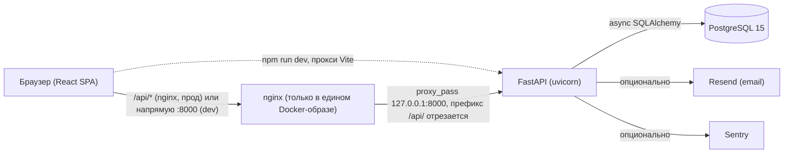

# Архитектура

## Стек

| Слой | Технология |
|---|---|
| Backend | Python 3.12, FastAPI (`extras=all`) 0.115, async SQLAlchemy 2.0, asyncpg |
| БД | PostgreSQL 15 |
| Валидация | Pydantic v2 + pydantic-settings |
| Миграции | Alembic (8 реальных миграций поверх пустого baseline) |
| Аутентификация | JWT (python-jose, HS256, 1 час) в httpOnly-куке, bcrypt (passlib) |
| PDF | `pdfkit` + wkhtmltopdf (бинарник ставится в Docker-образ напрямую) + Jinja2-шаблоны |
| QR/штрихкоды | `qrcode` + Pillow (генерация), `html5-qrcode` на фронтенде (сканирование) |
| Логи | structlog (JSON) + request-middleware с request_id |
| Ошибки | Sentry (опционально, по `SENTRY_DSN`) |
| Rate limiting | slowapi |
| Email | Resend API (опционально, по `RESEND_API_KEY`) |
| Frontend | React 19 + TypeScript, Redux Toolkit + RTK Query, Tailwind CSS 4, Vite 6, react-router 7 |
| UI-база | Шаблон **TailAdmin React** (`package.json: "name": "tailadmin-react"`) — часть страниц/компонентов до сих пор шаблонные заглушки, не относящиеся к CRM (см. [features.md](./features.md)) |

Backend: **~10 700** строк Python (152 файла) на момент анализа. Frontend: **~43 800** строк TS/TSX. Обе цифры выросли с июньского отчёта (`PROJECT_REPORT.md`: ~8 100 и ~41 800) — с тех пор было больше 40 коммитов, включая RBAC, password reset, сканер штрихкодов, перевод остатков между складами.

---

## Структура backend (`backend/app/`)

```
api/          32 роутера — тонкий HTTP-слой (валидация запроса, guard, вызов репозитория)
repositories/ вся бизнес-логика и SQL (async SQLAlchemy) — 33 файла
models/       30 ORM-моделей + 4 в rbac/
schemas/      Pydantic v2: раздельные Create / Update / Read схемы на домен
core/         config.py, database.py, dependencies.py, security.py, limiter.py, logging_config.py
rbac/         models.py, service.py, dependencies.py, schemas.py, seed.py — вся логика прав доступа
utils/        pdf.py, barcode_utils.py, stock.py, email.py, excel_products.py, init_*.py (сидинг)
templates/    supply_invoice.html, email_registration.html, email_approval.html, email_password_reset.html
```

Слоистая архитектура выдержана последовательно: роутеры не содержат SQL напрямую, вся логика — в `repositories/`.

## Структура frontend (`frontend/src/`)

```
store/
  slices/authSlice.ts        — состояние авторизации (через отдельный axios-клиент, см. ниже)
  api/                       — 27 RTK Query слайсов (baseQueryWithReauth)
  middleware/authErrorMiddleware.ts — автологаут при 401
hooks/
  usePermissions.ts          — актуальный RBAC-хук (hasPermission("resource.action"))
  useRoleAccess.ts           — старый хук на основе role.name/role_id (см. известные проблемы)
layout/                       — AppLayout (общий каркас всех защищённых страниц), AppSidebar, AppHeader
pages/                         — ~49 страниц, часть которых — шаблонные демо-страницы TailAdmin, не CRM-функциональность
components/scanner/            — сканер QR/штрихкодов (последняя добавленная фича)
```

---

## Как связаны фронтенд, бэкенд и БД



- **Локальная разработка**: frontend (`npm run dev`, Vite на 5173) обращается к backend напрямую по `VITE_API_URL` (по умолчанию `http://localhost:8000`), без общего префикса `/api`.
- **Продакшен-сборка** (корневой `Dockerfile`): фронтенд и бэкенд собираются в **один образ** — nginx отдаёт статику фронтенда и проксирует `/api/*` на `127.0.0.1:8000` (тот же контейнер), обрезая префикс. Поэтому в бандле фронтенда для прод-сборки `VITE_API_URL=/api` (build-arg).
- Куки (`access_token`) идут через тот же домен в продовой схеме — `SameSite=None; Secure` включается автоматически, если `BASE_URL` начинается на `https://`.

### Хостинг: Render.com (подтверждено командой)

Из кода однозначно определить это было нельзя — в репозитории одновременно остались следы **трёх** разных хостингов, и команда подтвердила, что актуален именно Render.com:

1. **Render.com — актуальный.** В корне лежит `render.yaml` с `healthCheckPath`, `generateValue` для `SECRET_KEY` и т.д. Но его собственный комментарий ссылается на функцию `_default_urls_from_render` в `core/config.py`, которой **в коде не существует** (удалена коммитом `295663b`) — это реальный, а не гипотетический баг для этого хостинга, см. [known-issues.md](./known-issues.md#8-мёртвая-конфигурация-flyio-и-railway-целевой-хостинг--rendercom) и критичный пункт №4 в [gaps-and-roadmap.md](./gaps-and-roadmap.md).
2. **Fly.io — мёртвый, требует чистки.** По коммитам решительно выведен из эксплуатации (`6c6a2af feat: remove deployment configuration...`), но `nginx/default.conf` (не `.template`!) до сих пор хардкодит `proxy_pass https://leadflow-backend.fly.dev/` — мёртвый файл, не используется текущей Docker-сборкой.
3. **Railway — устаревшие комментарии, требуют чистки.** Упоминается в комментариях `Dockerfile`, `docker-entrypoint.sh`, `nginx/default.conf.template` и `core/config.py` (динамический `$PORT`, `X-Forwarded-Proto` от edge-прокси, разбор `postgres://`-URL «managed Postgres providers (e.g. Railway)») — механизмы, которые описывают эти комментарии, продолжают работать и на Render (тоже прокидывает `$PORT`), но сами упоминания Railway вводят в заблуждение и стоят чистки.

---

## Авторизация и RBAC

Два параллельных, но осмысленно связанных механизма:

1. **Легаси-роль** (`users.role_id` → `roles.name`: `admin`/`manager`/`staff`) — исторически была единственным источником истины.
2. **RBAC** (`rbac_roles`, `permissions`, `rbac_role_permissions`, `rbac_user_roles`) — гранулярные права вида `"products.read"`, управляются через `/settings/roles` (UI) и `/rbac/*` (API). Пользователь всегда имеет одну базовую роль (`users.role_id`) и опционально — дополнительные кастомные RBAC-роли.

Комментарий в `app/rbac/service.py::user_is_admin`:

> «Stage D: RBAC is now the sole source of truth for admin access. The legacy `roles.name` fallback was removed…»

То есть на бэкенде миграция на RBAC для проверки «админ или нет» **уже завершена** — `is_admin` реально делегирует в RBAC-сервис, а не читает `roles.name` напрямую. Однако:

- Точечные права (`Depends(require_permission("products.read"))`) реально подключены только к **шести** кодам, и только к чтению: `products.read`, `customers.read`, `orders.read`, `stock.read`, `supplies.read`, `cashflow.read`. Все операции записи (create/update/delete) на всех доменах по-прежнему проверяются через грубый `is_admin` («админ — можно всё, не админ — нельзя ничего»), хотя в справочнике прав (`RESOURCE_LABELS`/`ACTION_LABELS` в `RolesPermissions.tsx`) уже описаны action'ы `create`/`update`/`delete`/`approve`/`export`/`manage_roles`/`invite` — то есть кастомная роль, ограниченная UI, реально не может дать пользователю права «может создавать заказы, но не может их удалять» — так глубоко RBAC ещё не докручен.
- На **фронтенде** есть отдельный, более старый хук `useRoleAccess.ts`, который вычисляет `isAdmin` локально из `user.role.name === 'admin' || user.role_id === 1` — то есть **не через RBAC**, а через тот самый легаси-признак, который бэкенд, по собственному комментарию в коде, уже не использует как источник истины. Это может рассинхронизировать UI и реальные права (см. known-issues.md).

---

## Модель данных

Подробная схема — [database-schema.md](./database-schema.md). Коротко: 34 таблицы, в основном на паттерне FK `ondelete="SET NULL"` для сохранения истории, но с несколькими исключениями (`Customer→orders`, `Branch→warehouses`, `User→payrolls/monthly_targets`), где ORM-уровневый `cascade="all, delete-orphan"` реально удаляет данные — разобрано в [known-issues.md](./known-issues.md).

Схема создаётся гибридно: на пустой БД `docker-entrypoint.sh` выполняет `Base.metadata.create_all()` (все модели сразу) и "штампует" Alembic как будто применены все ревизии; на уже существующей — просто `alembic upgrade head`. Это рабочее решение проблемы «пустой baseline», хотя `main.py`-lifespan всё ещё безусловно вызывает `init_db()` (`create_all`) при каждом старте приложения (идемпотентно для существующих таблиц, но не заменяет реальные ALTER-миграции для изменения существующих колонок).
