# Схема базы данных

PostgreSQL 15, доступ через async SQLAlchemy 2.0 (`asyncpg`). Все модели — `backend/app/models/*.py` (30 файлов) плюс RBAC-модели в `backend/app/rbac/models.py` (4 таблицы). Схема создаётся комбинированно: `Base.metadata.create_all()` при старте (`core/database.py::init_db`, вызывается из `main.py` при каждом запуске) плюс 8 реальных Alembic-миграций поверх пустого baseline — подробности в [setup.md](./setup.md#миграции-alembic) и [known-issues.md](./known-issues.md).

Всего **34 таблицы**.

---

## ER-диаграмма (укрупнённо, по доменам)

```mermaid
erDiagram
    BRANCH ||--o{ WAREHOUSE : "содержит"
    BRANCH ||--o{ USER : "сотрудники"
    BRANCH ||--o{ ORDER : "заказы филиала"
    WAREHOUSE ||--o{ PRODUCT_STOCK : "остатки"
    WAREHOUSE ||--o{ STOCK_LOG : "движения"
    WAREHOUSE ||--o{ SUPPLY : "поставки"
    WAREHOUSE ||--o{ ORDER : "заказы со склада"

    CATEGORY ||--o{ SUBCATEGORY : "содержит"
    CATEGORY ||--o{ PRODUCT : "категория"
    SUBCATEGORY ||--o{ PRODUCT : "подкатегория"
    BRAND ||--o{ PRODUCT : "бренд"
    PRODUCT ||--o{ PRODUCT_STOCK : "остаток по складам"
    PRODUCT ||--o{ ORDER_ITEM : "в заказах"
    PRODUCT ||--o{ SUPPLY_ITEM : "в поставках"
    PRODUCT ||--o{ STOCK_LOG : "движения"

    CUSTOMER_TYPE ||--o{ CUSTOMER : "тип"
    CUSTOMER ||--o{ ORDER : "заказы"
    ORDER_STATUS ||--o{ ORDER : "статус"
    PAYMENT_METHOD ||--o{ ORDER : "способ оплаты"
    ORDER ||--o{ ORDER_ITEM : "позиции"
    ORDER ||--o{ ORDER_HISTORY : "аудит"
    ORDER ||--o{ STOCK_LOG : "связанные движения"

    SUPPLIER ||--o{ SUPPLY : "поставки"
    SUPPLY ||--o{ SUPPLY_ITEM : "позиции"

    USER ||--o{ ORDER : "менеджер"
    USER ||--o{ PAYROLL : "зарплата"
    USER ||--o{ MONTHLY_TARGET : "план KPI"
    USER ||--o{ NOTIFICATION : "уведомления"
    USER ||--o{ PASSWORD_RESET_TOKEN : "токены сброса"
    ROLE ||--o{ USER : "базовая роль"
    POSITION ||--o{ USER : "должность"
    KPI_RULE ||--o{ PAYROLL : "правило KPI"

    CASH_FLOW_TYPE ||--o{ CASH_FLOW : "тип"
    CASH_FLOW_TYPE ||--o{ CASH_FLOW_CATEGORY : "категории типа"
    CASH_FLOW_CATEGORY ||--o{ CASH_FLOW : "категория"
    CASH_FLOW_CATEGORY ||--o{ BUDGET : "бюджет"

    RBAC_ROLE ||--o{ RBAC_ROLE_PERMISSION : "права роли"
    PERMISSION ||--o{ RBAC_ROLE_PERMISSION : "право"
    RBAC_ROLE ||--o{ RBAC_USER_ROLE : "назначения"
    USER ||--o{ RBAC_USER_ROLE : "кастомные роли"
    BRANCH ||--o{ RBAC_ROLE : "роль филиала"
```

---

## Каталог (products, categories, subcategories, brands)

### `categories`
| Поле | Тип | Ограничения |
|---|---|---|
| id | Integer PK | |
| name | String | `UNIQUE`, `NOT NULL` |
| is_active | Boolean | `NOT NULL`, default `True` |
| created_at | DateTime(tz) | `NOT NULL`, default `now()` |

Индексы: `ix_categories_is_active`, `ix_categories_created_at`. Связь: `subcategories` — **`cascade="all, delete-orphan"`** (удаление категории удаляет её подкатегории; см. [known-issues.md](./known-issues.md) про согласованность каскадов).

### `subcategories`
| Поле | Тип | Ограничения |
|---|---|---|
| id | Integer PK | |
| name | String | `NOT NULL` |
| category_id | Integer FK → categories.id | `ondelete=CASCADE` |
| is_active | Boolean | `NOT NULL`, default `True` |
| created_at | DateTime(tz) | `NOT NULL`, default `now()` |

Индексы: по `name`, `is_active`, `created_at`, `category_id`. Связь `products` — **без** cascade (комментарий в коде явно объясняет: удаление подкатегории не должно удалять товары — FK `products.subcategory_id` стоит `SET NULL`).

### `brands`
Аналогично `categories`: `id`, `name` (unique), `is_active`, `created_at`, индексы на `is_active`/`created_at`. Связь `products` — тоже намеренно без cascade.

### `products`
| Поле | Тип | Ограничения |
|---|---|---|
| id | Integer PK | |
| name | String(200) | `NOT NULL` |
| description | String(500) | nullable |
| detail | String(500) | nullable |
| cost_price | Float | `NOT NULL` |
| price | Float | `NOT NULL` |
| sku | String | `UNIQUE`, `NOT NULL` (+ явный `UniqueConstraint uq_product_sku`) |
| barcode | String | `UNIQUE`, nullable (EAN-13, валидируется на уровне схемы) |
| category_id | Integer FK → categories.id | `SET NULL` |
| subcategory_id | Integer FK → subcategories.id | `SET NULL` |
| brand_id | Integer FK → brands.id | `SET NULL` |

**Нет полей `is_active`/`status`** — в отличие от Category/Subcategory/Brand, у товара нет собственного статуса «архив/неактивен». `qr_code` и `available_quantity` в `ProductRead` — вычисляемые поля (генерируются в репозитории на лету, не хранятся в БД).

---

## Склад (warehouses, product_stock, stock_logs)

### `warehouses`
`id`, `name` (unique), `location`, `branch_id` FK → branches.id (`SET NULL`).

### `product_stock`
| Поле | Тип | Ограничения |
|---|---|---|
| id | Integer PK | |
| product_id | Integer FK → products.id | `ondelete=CASCADE` |
| warehouse_id | Integer FK → warehouses.id | `ondelete=CASCADE` |
| quantity | Integer | `NOT NULL`, default 0 |
| reserved | Integer | `NOT NULL`, default 0 (зарезервировано под неподтверждённые заказы) |
| updated_at | DateTime(tz) | default `now()` |

`UniqueConstraint(product_id, warehouse_id)` — один остаток на пару товар/склад. `quantity - reserved` = физически доступно к продаже.

### `stock_logs`
`id`, `product_id` FK (`CASCADE`), `warehouse_id` FK (`CASCADE`), `order_id` FK → orders.id (`SET NULL`, nullable), `created_by` FK → users.id (`SET NULL`), `quantity`, `type` (Enum `StockLogType`), `note`, `created_at`. Полный журнал движений: приход, списание, корректировка, перевод между складами — с привязкой к заказу и пользователю, если применимо.

---

## Клиенты и заказы

### `customer_types`
`id`, `name` (unique).

### `customers`
`id`, `name`, `phone` (unique), `email` (unique), `customer_type_id` FK (`SET NULL`), `address`, `created_at`. Связь `orders` — **`cascade="all, delete-orphan"`** ⚠️ (см. известные проблемы — противоречит `orders.customer_id` = `SET NULL`).

### `order_statuses`
`id`, `name` (unique) — справочник статусов заказа.

### `orders`
| Поле | Тип | Ограничения |
|---|---|---|
| id | Integer PK | |
| user_id | Integer FK → users.id | `SET NULL` (менеджер, оформивший заказ) |
| customer_id | Integer FK → customers.id | `SET NULL` |
| status_id | Integer FK → order_statuses.id | `SET NULL` |
| payment_method_id | Integer FK → payment_methods.id | `SET NULL` |
| installment_months | Integer | nullable |
| total_price | Numeric(10,2) | default 0 |
| finalized_total_price | Numeric(10,2) | nullable |
| delivery_address, note | Text | nullable |
| delivery_date | Date | nullable |
| warehouse_id | Integer FK → warehouses.id | `SET NULL` |
| branch_id | Integer FK → branches.id | `SET NULL` |
| created_at | DateTime(tz) | default `now()` |
| confirmed | Boolean | default False |
| confirmed_at | DateTime(tz) | nullable |
| cancelled_at | DateTime(tz) | nullable |
| cancellation_reason | Text | nullable |

Связь `items` — `cascade="all, delete-orphan"` (согласовано с `order_items.order_id` = `CASCADE`, ожидаемо).

### `order_items`
`id`, `order_id` FK (`CASCADE`), `product_id` FK → products.id (`SET NULL`), `quantity`, `unit_price` Numeric(10,2), `final_price` Numeric(10,2).

### `order_history`
`id`, `order_id` FK (`CASCADE`, индекс), `user_id` FK → users.id (`SET NULL`), `action` String(64), `description` Text, `created_at` (server default `now()`). Аудит-журнал: создание, подтверждение/снятие подтверждения, смена статуса, отмена с причиной.

### `payment_methods`
`id`, `name`, `surcharge_percent` Numeric(5,2) (наценка за рассрочку и т.п.), `max_months`.

---

## Поставки и поставщики

### `suppliers`
`id`, `name` (unique), `contact_person`, `contact_info`, `address`.

### `supplies`
`id`, `supplier_id` FK → suppliers.id (`SET NULL`), `warehouse_id` FK → warehouses.id (`ondelete=CASCADE`, `NOT NULL`), `created_by` FK → users.id (`SET NULL`), `delivered_at` (`NOT NULL`), `created_at` (server default). Связь `items` — `cascade="all, delete-orphan"`.

### `supply_items`
`id`, `supply_id` FK → supplies.id (**без `ondelete`**, полагается на ORM-каскад родителя), `product_id` FK → products.id (**без `ondelete`**), `quantity`, `cost_price`, `unit_price`.

---

## Филиалы, пользователи, роли

### `branches`
`id`, `name` (unique), `location`. Связь `warehouses` — **`cascade="all, delete-orphan"`** ⚠️ (см. известные проблемы).

### `roles` (легаси)
`id`, `name` (unique) — простой справочник (`admin`/`manager`/`staff`). Используется как основная роль пользователя (`users.role_id`), но с переходом на RBAC **больше не является источником истины для проверки прав** — см. ниже и [known-issues.md](./known-issues.md).

### `positions`
`id`, `name` — должности сотрудников (для зарплатного модуля).

### `users`
| Поле | Тип | Ограничения |
|---|---|---|
| id | Integer PK | |
| email | String | `UNIQUE`, `NOT NULL` |
| hashed_password | String | `NOT NULL` (bcrypt) |
| full_name, phone | String | nullable |
| is_active | Boolean | default True |
| is_approved | Boolean | default False (требует одобрения админом) |
| salary_base | Integer | `NOT NULL`, default 0 |
| role_id | Integer FK → roles.id | `SET NULL` |
| position_id | Integer FK → positions.id | `SET NULL` |
| branch_id | Integer FK → branches.id | `SET NULL` |
| created_at | DateTime(tz) | default `now()` |

Связи `payrolls` и `monthly_targets` — **`cascade="all, delete-orphan"`**, и соответствующие FK (`payrolls.user_id`, `monthly_targets.manager_id`) на уровне БД тоже `ondelete=CASCADE` — здесь ORM и БД согласованы (в отличие от `customers`/`branches`), но сам факт удаления безвозвратно стирает историю зарплат и KPI-планов сотрудника (см. известные проблемы).

### `password_reset_tokens`
`id`, `user_id` FK (`CASCADE`, индекс), `token` (unique, индекс), `expires_at`, `used` Boolean, `created_at`.

### `notifications`
`id`, `user_id` FK (`CASCADE`), `title`, `message`, `is_read` Boolean, `type` (`"order"`/`"user"`/`"system"`), `entity_id`, `created_at` (server default).

---

## RBAC (права доступа) — `app/rbac/models.py`

### `permissions`
`id`, `resource` String, `action` String, `code` String (unique, индекс — вида `"products.read"`). Справочник всех возможных прав в системе.

### `rbac_roles`
`id`, `branch_id` FK → branches.id (`SET NULL`, для ролей, ограниченных филиалом), `name`, `is_system` Boolean (системные роли Admin/Manager/Staff нельзя переименовать/удалить), `created_at`, `updated_at`.

### `rbac_role_permissions`
Составной PK (`role_id`, `permission_id`), оба `ondelete=CASCADE` — таблица связи роль↔право.

### `rbac_user_roles`
Составной PK (`user_id`, `role_id`), оба `ondelete=CASCADE` — таблица связи пользователь↔кастомная роль (в дополнение к основной `users.role_id`).

Подробно о том, как это используется на бэкенде, — в [architecture.md](./architecture.md#авторизация-и-rbac).

---

## Финансы

### `cash_flow_types`
`id`, `name` (unique) — `"income"` / `"expense"`.

### `cash_flow_categories`
`id`, `name` (unique), `type_id` FK → cash_flow_types.id (`ondelete=CASCADE`).

### `cash_flows`
`id`, `date` Date, `amount` Integer (всегда положительное), `type_id` FK (`ondelete=RESTRICT`), `category_id` FK (`SET NULL`), `source` String (например `"payroll"`, `"order"`), `entity_id` Integer, `description`.

### `budgets`
`id`, `month` String(7) (`'2025-07'`), `category_id` FK → cash_flow_categories.id (`ondelete=CASCADE`), `planned_amount` Integer, `created_by` FK → users.id (`SET NULL`), `created_at`. `UniqueConstraint(month, category_id)`.

### `cash_gap_forecasts`
`id`, `month` String(7), `expected_income`, `expected_expense`, `gap_amount` (expense − income), `comment`, `created_by` FK → users.id (`SET NULL`).

---

## Зарплата и KPI

### `kpi_rules`
`id`, `min_percent` Float (например `0.8` = 80% выполнения плана), `bonus` Integer, `penalty` Integer.

### `monthly_targets`
`id`, `manager_id` FK → users.id (`ondelete=CASCADE`), `month` Date, `target_amount` Float. `UniqueConstraint(manager_id, month)`.

### `payrolls`
`id`, `user_id` FK → users.id (`ondelete=CASCADE`), `month` String(7), `base_salary` Integer, `bonus_amount`, `penalty_amount`, `total_paid` Integer, `paid_at` **DateTime(timezone=True)** (исправлено 2026-08-29, миграция `a1b2c3d4e5f6` — раньше был `DateTime` без таймзоны, что ломало `POST /payrolls/{id}/pay` на каждом вызове, см. [CHANGELOG.md](../CHANGELOG.md)), `comment`, `created_by` FK → users.id (без `ondelete`), `kpi_percent` Integer, `kpi_rule_id` FK → kpi_rules.id (`SET NULL`).

---

## Особенности каскадного удаления (свод)

Проект в основном придерживается принципа **`ondelete="SET NULL"` для сохранения истории** (явно описан и соблюдён для `Product.category_id/subcategory_id/brand_id`, `Order.*`, `CashFlow.category_id` и большинства остальных связей) — были **исключения, где ORM-уровневый `cascade="all, delete-orphan"` реально удалял связанные записи**, а не обнулял FK; два из них исправлены 2026-08-29:

| Родитель | Каскадно удаляется | Согласовано с FK на уровне БД? |
|---|---|---|
| `Category` → `subcategories` | подкатегории | Да (`ondelete=CASCADE`) — ожидаемо |
| `Order` → `items` | позиции заказа | Да (`ondelete=CASCADE`) — ожидаемо |
| `Supply` → `items` | позиции поставки | FK без `ondelete`, но ORM обрабатывает сам — ожидаемо |
| `User` → `payrolls`, `monthly_targets` | вся зарплатная история и KPI-планы сотрудника | Да (`ondelete=CASCADE`) — безвозвратно теряется финансовая история; **осознанно не тронуто** (бизнес-решение, не баг рассинхронизации — см. [known-issues.md, п. 3](./known-issues.md)) |
| `Customer` → `orders` | ~~все заказы клиента~~ | ✅ **Исправлено 2026-08-29** — убран `cascade="all, delete-orphan"`, теперь заказы переживают удаление клиента (`customer_id` уходит в `NULL`, как и было задумано FK) |
| `Branch` → `warehouses` | ~~все склады филиала и всё, что на них~~ | ✅ **Исправлено 2026-08-29** — убран `cascade="all, delete-orphan"`, склады переживают удаление филиала |

Подробности исправления — [CHANGELOG.md](../CHANGELOG.md).
